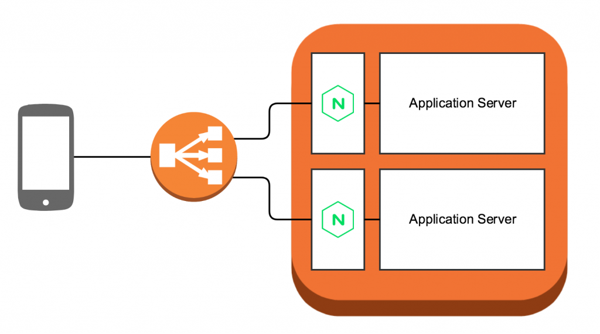

# CDK ECS Nginx sidecar pattern

`cdk-ecs-nginx-sidecar` is a ``aws/jsii`` construct library for AWS CDK.



## How to use this boilerplate

Edit `cdk/lib/ecs-stack.ts`, setting cpu & memory for task.

```ts
const taskDef = new ecs.FargateTaskDefinition(this, 'cdk-taskdef', {
  cpu: 256,
  memoryLimitMiB: 512,
});
```

Define real api backend container

```ts
const backendContainer: ecs.ContainerDefinitionOptions = {
  image: ecs.ContainerImage.fromAsset(path.join(__dirname, '../../api')),
  cpu: 0,
  logging: new ecs.AwsLogDriver({
    streamPrefix: 'echo-api-req',
    logRetention: logs.RetentionDays.ONE_MONTH,
  }),
  portMappings: [
    {
      containerPort: 8000,
    },
  ],
};
```

### Deploying / Updating the Backend Stack

Run `./deploy.sh` to deploy the backend stack.

### Other Commands

- Run `./diff.sh`   to compare deployed stack with current state
- Run `./synth.sh`  to display the generated CloudFormation script from the CDK code

- Run `./build.sh`  to compile all packages
- Run `./cdk-clean.sh`  to clean all cloudformation resources

## Modules

The example contains the following modules within these sub-folders:

### /cdk

This module is using [AWS CDK](https://docs.aws.amazon.com/cdk/api/latest/)

### /api

A simple backend API by nodejs (expressjs)

### /nginx

[NGINX](https://www.nginx.com/resources/wiki/) server
